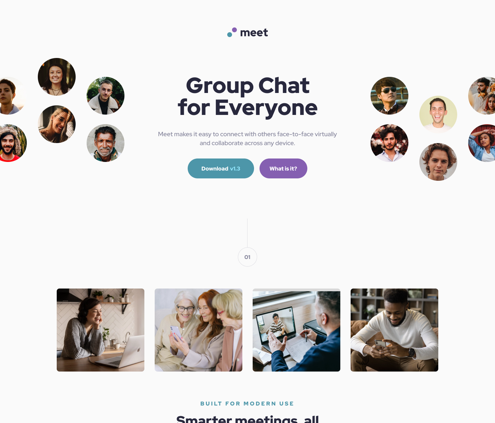

# My ninth project and solution to the meet landing page challenge over at [Frontend Mentor](https://www.frontendmentor.io/challenges)

I used this opportunity to further practice clean coding, CSS grids, CSS variables and most importantly a mobile first approach meaning I started coding the CSS by coding the mobile first then moving up to the desktop design with conditional CSS.

## This was the assignment

## This is my solution

[Click here to see the live page](https://arthurpog.github.io/meet-landing-page/)

